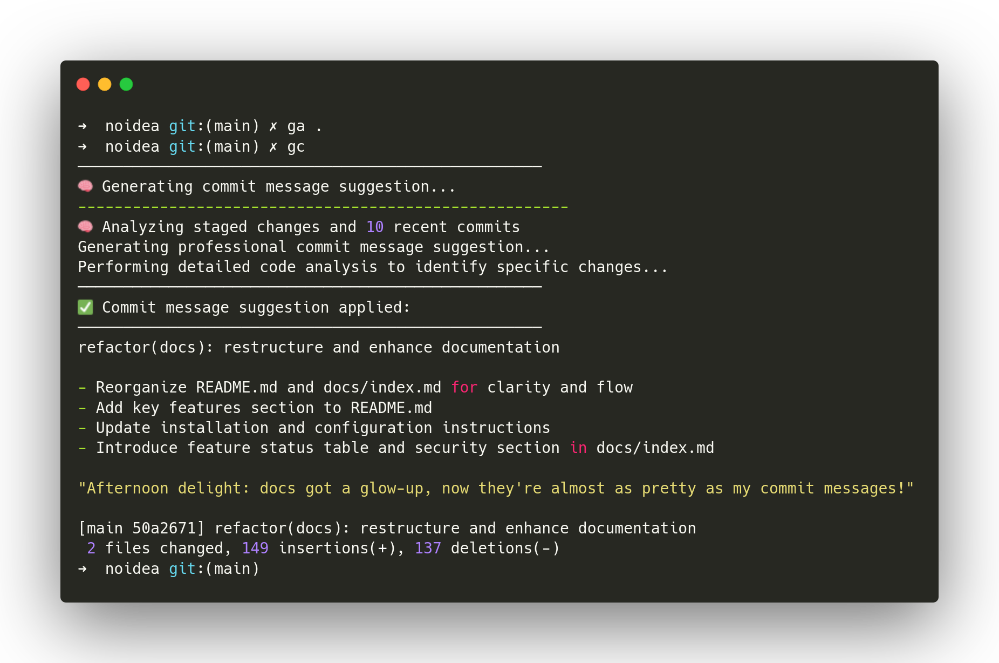

<div align="center">

# 🧠 noidea

<p align="center">
  <b>Git assistant with AI commit messages and sassy feedback</b>
</p>

<p align="center">
  <a href="https://opensource.org/licenses/MIT"></a>
  <a href="https://golang.org/doc/go1.18"></a>
</p>



</div>

## 🗿 What is noidea?

**noidea** is a Git companion that makes your commits better and funnier:

- **Get smart commit messages** based on your changes
- **Receive sassy feedback** from a judgmental Moai after each commit
- **Analyze your Git history** for insights and patterns
- **Seamless integration** with Git workflows

## ✨ Key Features

- 🧠 **AI-Powered Suggestions** - Get professional commit messages based on your staged changes
- 🗿 **Moai Feedback** - Receive witty, personalized feedback on your commits
- 📊 **Git Insights** - Track coding patterns and get weekly summaries
- 🎭 **Multiple Personalities** - Choose from several AI personalities for feedback
- 🔒 **Secure API Key Management** - Keep your AI provider keys safe

## 🚀 Quick Start

```bash
# Install noidea
git clone https://github.com/AccursedGalaxy/noidea
cd noidea
./install.sh # (might require sudo)

# Set up in your Git repo
cd /path/to/your/repo
noidea init

# Enable auto commit suggestions (optional)
git config noidea.suggest true

# Add your API key for AI features
noidea config apikey
```

### 📝 Commit Workflow With noidea

```bash
# Stage your changes
git add .

# Commit (noidea will suggest a message)
git commit
```
This will open your default editor with the suggested commit message. Save and close to approve and commit.

## 📚 Documentation

### 🔧 Installation Options

Choose one of these methods:

```bash
# Option 1: One-line quick install
curl -sSL https://raw.githubusercontent.com/AccursedGalaxy/noidea/main/quickinstall.sh | bash

# Option 2: Clone and install
git clone https://github.com/AccursedGalaxy/noidea.git
cd noidea
./install.sh
```

### 🤖 AI Configuration

For AI-powered features, add your API key:

1. **Securely store your API key (recommended):**
   ```bash
   noidea config apikey
   ```

2. **Add to environment (alternative):**
   ```bash
   export XAI_API_KEY=your_api_key_here
   ```

3. **Configure interactively:**
   ```bash
   noidea config --init
   ```

See [API Key Management](./docs/api-key-management.md) for secure storage details.

### 📋 Available Commands

| Command | Description |
|---------|-------------|
| `noidea init` | Set up Git hooks in your repository |
| `noidea suggest` | Get commit message suggestions |
| `noidea moai` | Display Moai feedback for the last commit |
| `noidea summary [--days 30]` | Generate summary of recent Git activity |
| `noidea feedback [--count 5]` | Analyze specific commits |
| `noidea config --init` | Configure noidea interactively |
| `noidea moai --list-personalities` | List all available personalities |

Run `noidea --help` for more information.

### 🎭 AI Personalities

noidea has several AI personalities for feedback:

- **Snarky Code Reviewer** - Witty, sarcastic feedback
- **Supportive Mentor** - Encouraging, positive feedback
- **Git Expert** - Technical, professional feedback
- **Motivational Speaker** - Energetic enthusiasm

```bash
# Use a specific personality
noidea moai --personality supportive_mentor
```

### ⚙️ Advanced Configuration

Create a `~/.noidea/config.json` file:

```json
{
  "llm": {
    "enabled": true,
    "provider": "xai",
    "api_key": "",
    "model": "grok-2-1212",
    "temperature": 0.7
  },
  "moai": {
    "use_lint": false,
    "faces_mode": "random",
    "personality": "snarky_reviewer",
    "personality_file": "~/.noidea/personalities.toml"
  }
}
```

## 🛠️ Feature Status

| Feature | Status |
|---------|--------|
| Moai face after commit | ✅ Done |
| AI-based commit feedback | ✅ Done |
| Config file support | ✅ Done |
| Weekly summaries | ✅ Done |
| On-demand commit analysis | ✅ Done |
| Commit message suggestions | ✅ Done |
| Enhanced terminal output | ✅ Done |
| POSIX-compatible hooks | ✅ Done |
| Lint feedback | 🛠️ In progress |
| AI GitHub issue management | 🔜 Coming Soon |

## 🤝 Contributing

Contributions are welcome! Whether you have ideas for new features, have encountered bugs, or want to improve documentation, we'd love your input.

Please feel free to submit an issue or join the discussions. Each contribution helps us make noidea better.

## 🤯 Why noidea?

Because Git is too serious. Coding is chaos. Let's embrace it.

This tool won't improve your Git hygiene, but it will make it more entertaining.

## 📃 License

This project is distributed under the MIT License. See the [LICENSE](LICENSE) file for details.

---

<div align="center">
Made with <code>noidea</code> and late-night energy.

<a href="https://github.com/AccursedGalaxy/noidea/stargazers"></a>
<a href="https://github.com/AccursedGalaxy/noidea/issues"></a>
</div>
