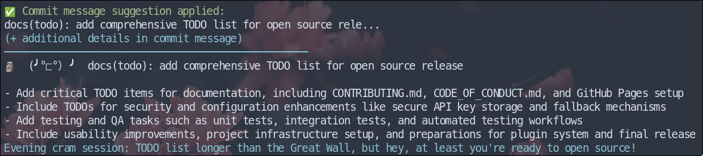

---
hide:
  - navigation
---

<div class="hero">
  <div class="hero-content">
    <h1><span class="animated-emoji">🧠</span> NoIdea</h1>
    <p>Git Assistant with AI Powers & Sassy Feedback</p>
    <div class="hero-buttons">
      <a href="#installation" class="md-button md-button--primary">Get Started</a>
      <a href="https://github.com/AccursedGalaxy/noidea" class="md-button">GitHub</a>
    </div>
  </div>
</div>

<div class="grid cards" markdown>

- :fontawesome-brands-git-alt: __Smart Commit Messages__

    Get intelligent commit message suggestions based on your changes

    [:octicons-arrow-right-24: Learn more](api-key-management.md)

- :material-message-text: __Sassy Feedback__

    Receive witty, personalized feedback from our judgmental Moai after each commit

    [:octicons-arrow-right-24: Features](#features)

- :material-chart-timeline: __Insights & Analysis__

    Analyze your Git history for patterns and trends

    [:octicons-arrow-right-24: Commands](#commands)

</div>

## Installation

```bash
# Quick install
curl -sSL https://raw.githubusercontent.com/AccursedGalaxy/noidea/main/quickinstall.sh | bash

# Clone and install
git clone https://github.com/AccursedGalaxy/noidea.git
cd noidea
./install.sh
```

## Features

- **AI-powered commit suggestions** - Generate semantic, descriptive commit messages
- **Post-commit feedback** - Get humorous commentary on your commit quality
- **Weekly summaries** - Track your coding patterns and productivity
- **Multiple AI personalities** - Choose the tone that fits your style



## Commands

| Command | Description |
| ------- | ----------- |
| `noidea init` | Set up Git hooks in your repository |
| `noidea suggest` | Get commit message suggestions |
| `noidea moai` | Display Moai feedback for the last commit |
| `noidea summary` | Generate summary of recent Git activity |
| `noidea feedback` | Analyze specific commits |
| `noidea config` | Configure noidea |

## Configuration

Configure noidea to match your workflow:

```bash
# Configure interactively
noidea config --init

# Add your API key (for AI-powered features)
noidea config apikey
```

!!! tip "Pro Tip"
    Enable auto-commit suggestions with `git config noidea.suggest true` to get suggestions every time you commit!

## Why NoIdea?

Because Git is too serious. Coding is chaos. Let's embrace it.

This tool won't improve your Git hygiene, but it will make it more entertaining.

---

<div class="github-card">
<a href="https://github.com/AccursedGalaxy/noidea" title="Star AccursedGalaxy/noidea on GitHub">
    
</a>
<a href="https://github.com/AccursedGalaxy/noidea/issues">
    
</a>
</div>
